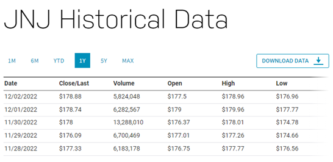

# JNJ
JNJ 주식 데이터 분석 및 주가 예측
<br/>
<br/>

**Introduction to Analytical Data**
<br/>


본 보고서에서 사용할 데이터셋은 Johnson and Johnson Common Stock (JNJ)으로, 주식 데이터이다.
JNJ 주식의 최근 1년 동안의 데이터를 다루며, 날짜(Date), 종가(Close/Last), 거래량(Volumne), 시가(Open), 고가(High), 저가(Low) 컬럼으로 데이터가 구성되어있다.
<br/>
- Date : 하루 간격으로 측정된 날짜
- Close/Last : 장 마감시간에 동시 호가를 통해서 최종적으로 결정된 주식의 가격
- Volume : 하루 동안의 거래량
- Open : 증권 거래소에서 형성되는 주식의 가격 (주식의 최초 가격)
- High : 하루 동안의 최고가
- Low : 하루 동안의 최저가
<br/>
본 데이터셋은 주식의 가격이 시간적 순서를 가진 데이터셋이며, 동일한 간격의 시간의 증가에 대해 순차적으로 기록된 2개 이상의 변수 관측치로 구성된 다변량 시계열 데이터임을 확인할 수 있다.


<br/>
데이터를 본격적으로 분석하기에 앞서, 데이터 전처리 과정을 짚고 넘어가야 한다.
데이터 전처리는 특정 분석에 적합하게 데이터를 가공하는 작업을 의미한다. 이는 모델 학습에 데이터셋을 사용할 수 있기 전에 수행해야 하는 매우 중요한 작업이다.
원시 데이터는 노이즈가 많고, 불완전하며, 값이 누락된 경우가 종종 있다. 이러한 데이터를 모델링에 사용하면 결과가 잘못될 가능성이 크다. 데이터 전처리는 이를 방지하기 위한 사전 작업을 의미한다. Kaggle의 창립자인 Anthony Goldbloom은 데이터 과학의 80%는 데이터 전처리에 소비되고, 나머지 20%는 데이터 전처리를 하는 시간을 불평하는데 쓰인다고 언급할 정도로 데이터 전처리 과정이 매우 중요한 작업임을 뜻한다.

<br/>
<br/>
<li>불완전 : 데이터에 특성이 없거나, 값이 누락되어 있다.</li>
<li>노이즈 : 데이터에 잘못된 레코드 또는 이상값이 포함되어있다.</li>
<li>불일치 : 데이터에 충돌하는 레코드 또는 일치하지 않는 값이 있다.</li>
<br/>
<br/>

이 외에도 원시 데이터에는 생각보다 많은 문제점들이 포함되어 있을 수 있다. 우수한 예측 모델을 구축하려면 우수한 데이터가 필요하다. “쓰레기를 넣고 쓰레기를 얻는 현상”을 방지하고 데이터 품질을 높여서 궁극적으로 모델 성능을 높이려면 데이터 상태 검사를 수행하여 조기에 데이터 문제를 발견하고 적절한 데이터 처리 및 정리 단계를 결정하는 것이 중요하다.
<br/>
<br/>

**Data Preprocessing**
<br/>
```python
df = pd.read_csv("./data/JNJ.csv")
df
```
<br/>
먼저 확보한 데이터셋을 불러온 다음, 출력시켜 시각적으로 확인한다. 이는 ‘데이터셋을 다운로드 받을 때도 이미 확인하고 다운로드 받았던건데 굳이 또 확인을 해야할까?’ 라는 생각이 들 수 있다. 하지만 데이터를 다운로드 받고 불러오는 과정에서 글자가 깨지는 부분은 없었는지 등의 문제를 이 과정을 통해서 다시 한번 검토할 수 있기 때문에 필요로 하는 과정이다. 본 보고서에서는 작업 디렉토리에 있는 data 폴더에 데이터셋을 저장했기에 상대경로를 지정하여 간편하게 데이터를 불러왔다.
<br/>
<br/>

<br/>
<br/>
분명 1년 치의 데이터를 다운로드 받았지만 불러온 데이터를 확인해본 결과 row의 개수가 251밖에 되지않는다.
1년치를 제대로 받아왔다면 row의 개수는 365여야 할 것이다.
Date 컬럼의 시작점과 끝점을 확인해보면 알 수 있다.
0번 인덱스가 2022년 12월 2일인데 마지막 250번 인덱스의 날짜는 2021년 12월 6일이다. 이를 통해 해당 데이터셋은 정확하게 365일을 끊어서 배포한 데이터셋이 아닌 것으로 확인되었다. 또한, 중간중간에 누락된 날짜들이 존재하였다.
날짜 값은 존재하지만 주식의 가격 부분에서 NaN 값이 존재할 경우에는 이는 결측치에 해당하기 때문에 우리는 데이터 전처리 과정에서 해당 날짜의 주식 데이터는 아예 제거하는 것이 바람직하다. (결측치 제거) 하지만 본 데이터셋에서는 그런 경우가 아닌, 날짜 자체가 존재하지 않았기 때문에 결측치 또한 존재하지 않는 데이터셋임을 확인하였다.
이어서 데이터 분석을 하기에 앞서 우리는 우리가 분석할 데이터의 자료형 즉, 데이터 타입이 무엇인지를 알아야 한다.
df.info() 혹은 df.dytpes 함수를 사용하면 간단하게 우리가 사용할 데이터셋의 정보를 파악할 수 있다.
그러나 굳이 사용하지 않고 눈으로만 봐도 Volume 컬럼을 제외한 모든 컬럼은 Object 형임을 알 수 있다.
왜냐하면 Volumne 컬럼만 정수로 구성되어있고, 나머지 컬럼들은 $, / 같은 특수문자가 포함되어 있기 때문이다.
우리는 데이터 분석을 위해 가장 걸리적거리는 Close/Last, Open, High, Low 컬럼의 $ 표시를 지우는 것이 최우선적으로 해야될 일일 것이다. 인덱스에 $ 표시가 같이 있으면 해당 인덱스의 값 자체가 Object형으로 인식되어 수학적인 연산을 할 수 없기 때문이다. 따라서 주식의 가격을 사용하여 어떠한 연산 작업을 수행하기 위해서는 해당 컬럼의 데이터 타입을 모두 연산이 가능한 데이터 타입(int, float, double)형으로 지정해주어야 한다.
<br/>
<br/>
```python
df['Close/Last'] = df['Close/Last'].str.replace(pat='$', repl=r'', regex=True)
df['Open'] = df['Open'].str.replace(pat='$', repl=r'', regex=True)
df['High'] = df['High'].str.replace(pat='$', repl=r'', regex=True)
df['Low'] = df['Low'].str.replace(pat='$', repl=r'', regex=True)
df
```
<br/>
<br/>
column.str은 문자열이면서 동시에 Series이다. 따라서 replace 함수를 적용할 수 있다.
파라미터는 다음과 같다.
<br/>
<br/>
<li>Series.str.replace(pat, repl, n=-1, case=None, flags=0, regex=None)</li>
<br/>
<br/>
